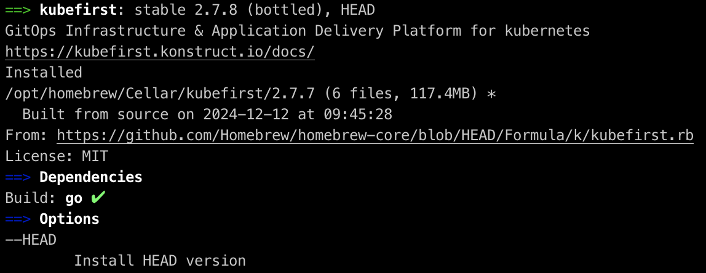
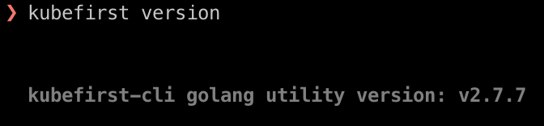

You just upgraded to the latest version of a software that is critical to you, and there is a new bug that is causing you problems. It's software, it happens... You cannot wait for a fix to be released, so the easiest step would be to downgrade to the previous version which was working perfectly. Unfortunately if you installed it using [Homebrew](https://github.com/Homebrew/brew), unless the maintainers release different [versions](https://docs.brew.sh/Versions), which is rarely the case, there is no built-in way to do that. There is still a method for you to _easily_ do this. Let's try it with [Kubefirst](https://konstruct.io/kubefirst).

First, find the file defining the keg that is used for the formula or cask you want to downgrade:

```shell
brew info kubefirst
```

The output will look like this



You can find the keg file used to install it listed next to the `From:` label: <https://github.com/Homebrew/homebrew-core/blob/HEAD/Formula/k/kubefirst.rb>

Open the file in your browser, check the Git history, and open the commit for the version you want to install, in my case, 2.7.7. Click on the `View code at this point` icon which brings you to <https://github.com/Homebrew/homebrew-core/blob/3547be4a29b9e2a5cf1ccb8d624d81f7a4403cf8/Formula/k/kubefirst.rb>, and click the `Raw` button to get the absolute URL for the file itself. Now download a copy of the file locally:

```shell
curl https://raw.githubusercontent.com/Homebrew/homebrew-core/3547be4a29b9e2a5cf1ccb8d624d81f7a4403cf8/Formula/k/kubefirst.rb > kubefirst.rb
```

Before installing the desired version, uninstall the unwanted one:

```shell
brew uninstall kubefirst
```

Now you can proceed, and install the version you wanted directly from the file you downloaded:

```shell
# Use --cask if it's a Cask
brew install --formula kubefirst.rb
```

The `--formula` flag is optional, but if not used, Homebrew will complain, but it will still work. Once you ran the previous command, you successfully downgraded Kubefirst from 2.7.8 to 2.7.7.



There may be simpler ways to install specific versions of any Homebrew kegs, but this is the easiest I came up with.

_Photo by Nextvoyage_
